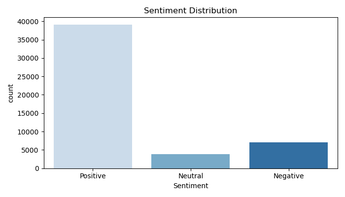
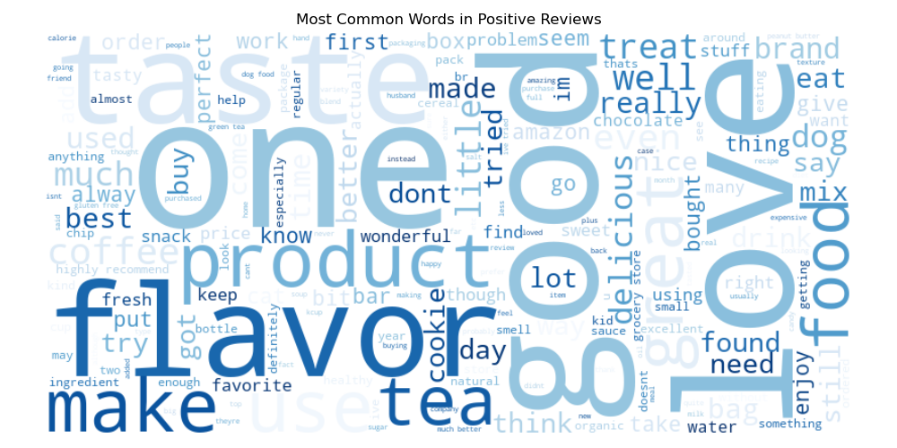
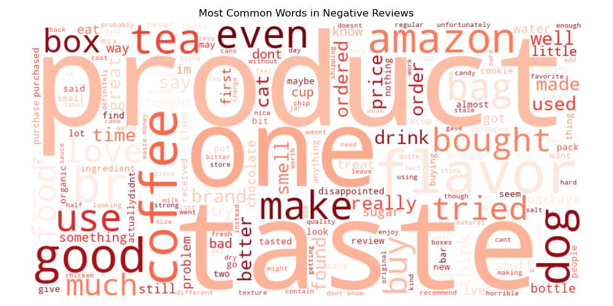

# Sentiment-analysis
# 💬 Product Review Sentiment Analysis

## 📌 Project Overview
Built a sentiment analysis model that classifies 50,000+ Amazon 
food reviews as Positive, Neutral, or Negative using NLP techniques.

## 🔧 Tools Used
- Python (Pandas, NLTK, Scikit-learn, WordCloud, Seaborn)
- Spyder IDE

## 🤖 Model Results
| Metric | Score |
|---|---|
| Overall Accuracy | 85.39% |
| Positive Precision | 87% |
| Negative Precision | 75% |

## 📊 Key Findings
- 78% of reviews are Positive
- Model correctly identifies Positive reviews 98% of the time
- Neutral reviews are hardest to classify (common in NLP)

## 📈 Visualizations

## 📁 Project Files
| File | Description |
|---|---|
| `sentiment.py` | Full code |
| `sentiment_distribution.png` | Sentiment breakdown chart |
| `positive_wordcloud.png` | Common words in positive reviews |
| `negative_wordcloud.png` | Common words in negative reviews |

## 🚀 How to Run
1. Clone this repo
2. Install requirements: `pip install pandas nltk scikit-learn wordcloud seaborn`
3. Run `sentiment.py` in Spyder or any Python IDE
